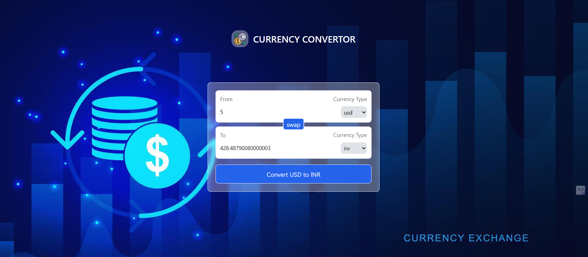

# 💱Currency Converter App

A responsive currency converter application built with React that allows users to convert between different currencies using real-time exchange rates.

## Features
Real-time currency conversion using live exchange rates

Swap currencies with a single click

Clean, modern UI with a currency-themed background

Responsive design that works on all devices

Easy-to-use interface with intuitive controls

## Technologies Used
React.js

Tailwind CSS

Fetch API for currency data

Exchange Rate API

## Usage
Enter the amount you want to convert

Select the "From" currency (default: USD)

Select the "To" currency (default: INR)

Click "Convert" to see the result

Use the "Swap" button to quickly switch between currencies
## Project Structure
src/
├── components/ 
│   └── InputBox.jsx      # Reusable input component with currency selection  

├── hooks/  
│   └── useCurrencyInfo.js # Custom hook for fetching currency data  

├── App.jsx  # Main application component  
  └── assets/               # Image assets

## Installation
 step-1 git clone https://github.com/your-username/currency-converter.git
 step-2 cd currency-converter
 step-3 npm install
 step-4 npm run dev

## Contributing
Contributions are welcome! Please open an issue or submit a pull request.
